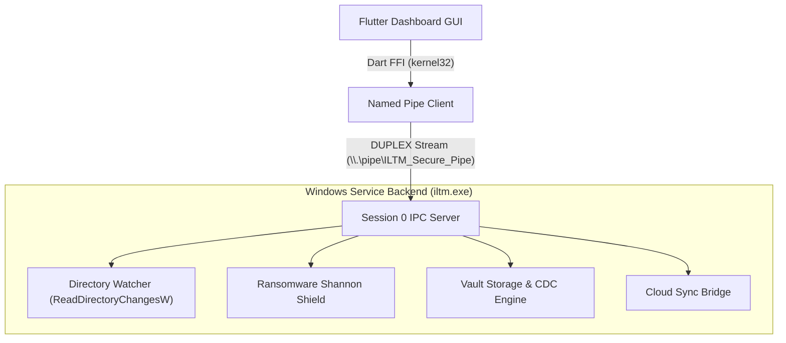

# 🛡️ Immutable Local Time Machine (ILTM)

<!-- Badges -->


Immutable Local Time Machine (ILTM), Windows işletim sisteminde verileri fidye yazılımlarına (Ransomware) karşı korumak, verimli sürüm geçmişi tutmak ve anlık kurtarma sağlamak amacıyla tasarlanmış, **Session 0 izolasyonunda koşan C++ Windows Servisi** ve **Flutter Masaüstü Kontrol Arayüzü** entegrasyonuna sahip hibrit bir veri güvenlik kalkanıdır.

---

## 🏗️ Sistem Mimarisi (Architecture)

ILTM; yüksek ayrıcalıklı arka plan servisi, Named Pipe tabanlı IPC köprüsü ve kullanıcı oturumunda koşan görsel yönetim panelinden oluşur.



---

## 🚀 Öne Çıkan Özellikler (Key Features)

### 1. İçerik Duyarlı Bölümleme ve Tekilleştirme (CDC & Deduplication)
Sabit boyutlu (static) bloklama yerine Rabin-Karp tabanlı **Content-Defined Chunking (CDC)** algoritması kullanılır. Dosyalar, içeriklerindeki yapısal değişikliklere göre dinamik olarak 16 KB ile 256 KB (ortalama 64 KB) arasındaki bloklara bölünür. Sadece değişen benzersiz bloklar şifrelenerek kasaya yazılır, böylece disk alanı %90'a varan oranda optimize edilir.
* İlgili Kod: [dedup.h](file:///c:/Users/burak/Desktop/Yeni%20klas%C3%B6r/src/core/dedup.h)

### 2. Shannon Entropi Tabanlı Fidye Yazılımı Kalkanı (Ransomware Shield)
Dosya yazma olayları yakalandığında, her dosya bloğunun Shannon Entropi değeri hesaplanır. Şifrelenmiş veya yüksek düzeyde rastgele veriler (entropi > 7.6) 2 saniyelik kayan zaman penceresinde izlenir. 2 saniyede 10'dan fazla yüksek entropili yazma işlemi algılandığında **Saldırı Panik Durumu** tetiklenir, gözcü kilitlenir ve verinin üzerine yazılması engellenir.
* İlgili Kod: [ipc_server.cpp](file:///c:/Users/burak/Desktop/Yeni%20klas%C3%B6r/src/core/ipc_server.cpp)

### 3. Asenkron Çift Hedefli Aynalama (Cloud & Local Mirror Sync)
Yedeklenen kasa dosyası (`vault.bin`) asenkron thread'ler üzerinde hem yerel bir yedekleme sürücüsüne (`Local Mirror`) hem de WinINet API'leri kullanılarak HTTPS PUT protokolü üzerinden uzak bir bulut sunucusuna (`Cloud Sync`) kopyalanır.
* İlgili Kod: [cloud_sync.cpp](file:///c:/Users/burak/Desktop/Yeni%20klas%C3%B6r/src/core/cloud_sync.cpp)

### 4. Akıllı Glob Filtreleme Motoru (Filter Engine)
İzlenecek dosyalar kullanıcı tanımlı kurallara göre (`+` dahil et, `-` hariç tut) süzgeçten geçirilir. Filtre kuralları diskteki `rules.txt` dosyasında tutulur ve dinamik olarak güncellenir.
* İlgili Kod: [filter_engine.h](file:///c:/Users/burak/Desktop/Yeni%20klas%C3%B6r/src/core/filter_engine.h)

---

## 📡 IPC Protokolü ve FFI Köprüsü (FFI Bridge)

Flutter GUI, `kernel32.dll` fonksiyonlarını Dart FFI aracılığıyla doğrudan bağlayarak Win32 boru hattı üzerinden C++ servisi ile kalıcı (persistent) bağlantı kurar.

| Komut ID | Komut Adı | Açıklama |
| :--- | :--- | :--- |
| **1** | `CMD_START_WATCHER` | Hedef dizini izlemeye başlar. |
| **2** | `CMD_STOP_WATCHER` | İzlemeyi durdurur ve panik durumunu sıfırlar. |
| **3** | `CMD_GET_VERSIONS` | Seçilen dosyanın sürüm geçmişini ve zaman damgalarını döner. |
| **4** | `CMD_RESTORE` | Belirtilen sürümü kasadan geri yükler. |
| **5** | `CMD_GET_STATUS` | Servisin güncel çalışma durumunu, izlenen yolu ve panik dosyasını döner. |
| **6** | `CMD_SET_RULES` | Glob filtre kurallarını günceller. |
| **7** | `CMD_GET_VERSION_CONTENT` | Sürümler arası görsel fark (Diff) gösterimi için ham sürüm verisini çeker. |

* İletişim Köprüsü: [ipc_bridge.dart](file:///c:/Users/burak/Desktop/Yeni%20klas%C3%B6r/gui/lib/ipc_bridge.dart)

---

## ⚙️ Derleme ve Kurulum (Build Instructions)

### Sistem Gereksinimleri
* Windows 10 / 11 x64
* MinGW-w64 (GCC 8.1.0 veya üzeri)
* Flutter SDK (Masaüstü Desteği Aktif)

### Derleme Adımları
1. C++ Backend projesini g++ ile derleyin:
   ```powershell
   g++ -std=c++2a src/main.cpp src/core/watcher.cpp src/core/console_ui.cpp src/core/vault_storage.cpp src/core/crypto_aes.cpp src/core/ipc_server.cpp src/core/cloud_sync.cpp src/extension/carver.cpp -o iltm.exe -lbcrypt -lwininet
   ```
2. Servisi sisteme kaydetmek için Yönetici yetkileriyle çalıştırın:
   ```powershell
   .\iltm.exe --install
   ```

---

## 🏁 Hızlı Başlangıç (Quick Start)

Sistemi sıfırdan kurup çalıştırmak için aşağıdaki adımları sırayla takip edin:

1. **Şifreleme Anahtarını Oluşturun:** Kasa şifreleme anahtarını üretmek için `iltm.exe` dosyasını konsol modunda çalıştırın. Şifrenizi belirledikten sonra dizinde `master.key` üretilecektir.
2. **Servisi Kaydedin ve Başlatın:** Yönetici yetkileriyle açılmış PowerShell konsolunda sırasıyla `.\iltm.exe --install` ve `Start-Service ILTM_Secure_Service` komutlarını çalıştırın.
3. **Flutter Kontrol Panelini Ateşleyin:** `gui` dizinine gidip `flutter run -d windows` komutunu çalıştırarak kontrol arayüzünü açın.
4. **İzleme Başlatın:** Kontrol panelinden izlemek istediğiniz klasör yolunu belirterek "İzlemeyi Başlat" butonuna tıklayın.

---

## 🔒 Güvenlik ve Yetkilendirme
* **Session 0 İzolasyonu:** Arka plan servisi SYSTEM yetkileriyle Session 0 altında koşan güvenli alanda çalışır. Kullanıcı oturumundaki zararlı yazılımlar servisin bellek alanına doğrudan müdahale edemez.
* **Null DACL:** `CreateNamedPipeW` borusu oluşturulurken Null DACL (Discretionary Access Control List) güvenlik tanımlayıcısı atanmıştır. Bu sayede düşük yetkili kullanıcı oturumunda çalışan Flutter GUI'nin servise erişim engelleri aşılmıştır.
* **Kasa Güvenliği:** Kasaya yazılan her bir veri bloğu, `MasterKey` ile blok karmasının (hash) birleştirilmesiyle türetilen benzersiz anahtarlar kullanılarak **AES-256-CBC** ile şifrelenir.

---

## 🤝 Katkıda Bulunma (Contributing)

ILTM gelişimine katkıda bulunmak isteyenler için:
1. Bu depoyu **fork** edin.
2. Yeni bir özellik dalı (**feature branch**) açın: `git checkout -b feature/AmazingFeature`.
3. Değişikliklerinizi **commit** edin: `git commit -m 'feat: Add some AmazingFeature'`.
4. Dalınızı **push** edin: `git push origin feature/AmazingFeature`.
5. Bir **Pull Request** oluşturun.

---

## 📄 Lisans (License)

Bu proje **MIT Lisansı** altında lisanslanmıştır. Detaylar için projedeki lisans bildirimlerine başvurabilirsiniz.
